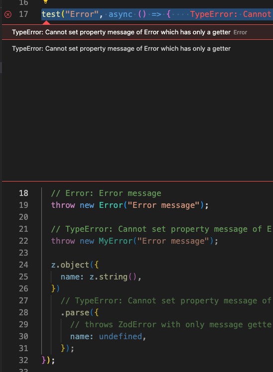

# Playwright issue

## TypeError: Cannot set property message of [object Object] which has only a getter

An issue with custom Errors that have a getter for the message property.

For some reason Playwright is trying to set the message property of the error object, which is not allowed in some Error classes.
So, this causes a TypeError to be thrown

For instance:

```ts
class MyError extends Error {
  #issues: string[] = [];
  constructor(message: string) {
    super();
    this.name = "MyError";
    this.#issues.push(message);
  }

  get message() {
    return this.#issues.join("\n");
  }
}
```

If this error is thrown in a Playwright test, it will fail with the following error:

```
TypeError: Cannot set property message of Error which has only a getter
```

instead of the original error message

the same can be applied to the `zod` [error](https://github.com/colinhacks/zod/blob/master/src/ZodError.ts#L192-L309)

```ts
z.object({
  name: z.string(),

}).parse({
  name: undefined,
});
```

Instead of indicating that the `name` property is missing, it will fail with an error:

```
TypeError: Cannot set property message of [object Object] which has only a getter
```


